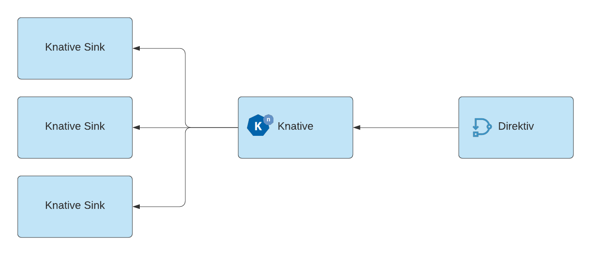

# Event Source for Direktiv and Knative

This repository contains the Direktiv source for Knative. It forwards events created in Direktiv to Knative. These events can be either coming from an explicit [GenerateEvent state](https://docs.direktiv.io/docs/specification.html#generateeventstate) or actions within the system, e.g. creating namespaces.

<p align="center">

</p>

The source is implemented as [ContainerSource](https://knative.dev/docs/eventing/samples/container-source/) and requires one argument to connect to the Direktiv instance via GRPC.

```yaml
apiVersion: sources.knative.dev/v1
kind: ContainerSource
metadata:
  name: direktiv-source
spec:
  template:
    spec:
      containers:
        - image: vorteil/direktiv-knative-source
          name: direktiv-source
          args:
            - --direktiv=direktiv-flow.default:3333
  sink:
    ref:
      apiVersion: eventing.knative.dev/v1
      kind: Broker
      name: default
```
